[//]: # (***)

[//]: # (#### &#40;временно&#41;)

[//]: # (# TechBazzar)

[//]: # (Данные проекта:  )

[//]: # (Ссылка на [репозиторий][repo]   )

[//]: # (Гугл [документ][doc] проекта, ТЗ.)

[//]: # ()
[//]: # ([repo]: https://github.com/SergeiMarkushov/TechBazzar)

[//]: # ([doc]: https://docs.google.com/document/d/1r1NcJigLT8cSW7z1JUSfOGne5YAHIotE77O1uCUTVQQ)

[//]: # (#### &#40;временно&#41;)

[//]: # (***)

# Проект
## Интернет-магазин "TechBazzar"
***

***
## Цель проекта
- [x] Применить свои навыки на практике.
- [x] Узнать что-то новое и внедрить в проект.
- [x] Разработать сервис “Интернет магазин“.
- [x] Сервис позволяет осуществлять деятельность интернет-магазина.
- [ ] Сервис должен быть доступен в браузере через интернет.

## UserStory
### В магазине должны быть реализованы следующие правила:

- [ ] Функционал админа расширяет весь упомянутый функционал пользователя;
- [ ] Админ может добавлять и изменять любую информацию о товарах в магазине;
- [ ] Информация о товаре состоит из:      
  -    Названия;
  -    Описания;
  -    Организации;
  -    Цены;
  -    Количества на складе;
  -    Информации о скидках;
  -    Отзывов;
  -    Ключевых слов;
  -    Таблицы характеристик;
  -    Изображения продукта(id изображения);
  -    Оценок.

- [ ] Для товара или группы товаров админ может добавлять и изменять скидки;
- [ ] Информация о скидке состоит из:
  -  Задействованных товаров;
  -  Объема скидки;
  -  Длительности скидки.

- [ ] Для того чтобы воспользоваться магазином, пользователь должен быть зарегистрированным и войти в учетную запись;
- [ ] Пользователь может покупать товары, оставлять о них отзывы и ставить оценки;
- [ ] Каждая покупка должна сохраняться в истории покупок;
- [ ] Пользователь может просмотреть свою историю покупок;
- [ ] Админ может просмотреть историю покупок любого пользователя;
- [ ] Пользователь может совершить возврат в течении суток с момента покупки;
- [ ] Пользователь не может оценить или оставить отзыв о товаре, не купив его;
- [ ] Информация о пользователе состоит из:
  -  Юзернейма;
  -  Почты;
  -  Пароля;
  -  Баланса;
  
- [ ] Админ может пополнять баланс пользователя;
- [ ] Админ может просматривать информацию о пользователях, удалять и замораживать их аккаунты;
- [ ] Админ может отправлять пользователям уведомления;
- [ ] После модерации организаций и продуктов отправлять уведомление владельцам;
  -  Уведомления состоят из:
  -  Заголовка уведомления;
  -  Даты уведомления;
  -  Текстового содержания уведомления;
  
- [ ] Пользователь может просмотреть свои уведомления;
- [ ] Пользователь может подать заявку на регистрацию организации;
- [ ] Организация дает возможность ее создателю добавлять товары и продавать их в данном магазине;
- [ ] Организация состоит из:
  - Имени;
  - Описания
  - Логотипа;
  - Товаров;

- [ ] Так как заявка на регистрацию организации добавляется авторизованным пользователем, то получателем выручки является данный пользователь;
- [ ] Каждый пользователь может создавать неограниченное количество организаций;
- [ ] Пользователи, зарегистрировавшие свою организацию, могут добавлять заявки на регистрацию товаров, и после модерации будут добавлены в общий список товаров; 
- [ ] При добавлении товара пользователем, он обязан указать, от лица какой организации этот товар поставляется;
- [ ] Выручку с покупки товаров, принадлежащих организации, за вычетом комиссии, получает организация. Комиссия произвольная (например, 5%);
- [ ] Админ вправе принимать заявки на регистрацию организации, замораживать и удалять активные организации
- [ ] Если организация заморожена или удалена, пользователи не должны видеть товары в списке доступных, однако, у купленных товаров должна сохраняться информация об организации. Т.е. даже об удаленных, а точнее забаненных организациях информация должна оставаться;
- 
- 
- 
- [ ] Механизм модерации магазина:
  - После регистрации user может создать организацию, которая отправится на модерацию администратору;
  - После подтверждения организации, user может добавлять продукты от своей организации, которые так же проходят модерацию у
  администратора; 
  - Администратор может заблокировать организацию по каким либо причинам, после разблокировки
  все настройки организации снова становятся актуальными. 
  - Администратор так же может заблокировать пользователя; 

### Идеологически магазин реализует подход Kanban
***
# Команда
| ФИ               | Роль                        | Контакт                    |
|------------------|-----------------------------|----------------------------|
| Бородинов Юрий   | бэк, youGile manager        | Telegram - @Aditon         |
| Бехтер Николай   | бэк, ведущий проекта        | Telegram - @N_Bekhter      |
| Шеховцов Сергей  | бэк, технологии             | Telegram - @sergey_shekhov |
| Маркушов Сергей  | бэк, GitHub manager, дизайн | Telegram - @Serega_Markus  |
| Федоренко Вадим  | фронт, бэк, дизайн          | Telegram - @KekNyaV        |
***
# Архитектура

***
## Решение представляет собой набор из сервисов:

- [ ] cart-service
- [ ] config-service
- [ ] core-service
- [ ] eureka-service
- [ ] gateway-service
- [ ] notification-service
- [ ] organization-service
- [ ] picture-service
- [ ] user-service
- [ ] support(в разработке)
***

# Технологии
## В проекте используются следующие технологии:

- [ ] Java 17;
- [ ] Spring boot;
- [ ] spring-boot-starter-mail;
- [ ] spring-boot-devtools;
- [ ] Spring Cloud Gateway;
- [ ] jakarta.xml.bind-api;
- [ ] jaxb-api;
- [ ] JPA;
- [ ] webflux;
- [ ] Flyway;
- [ ] jjwt;
- [ ] lombok;
- [ ] Swagger;
- [ ] Docker;
- [ ] Postgresql;
- [ ] maven;
- [ ] React.js;
- [ ] Axios;
- [ ] Formik;
- [ ] TypeScript;
- [ ] openapi-ui Swagger;
- [ ] Eureka;
- [ ] Keycloak;

***
# Данные проекта
### Ссылка на [репозиторий][repo]
[repo]: https://github.com/SergeiMarkushov/TechBazzar "репозиторий"
***

# Функционал интернет-магазина:
- [ ] Вход\Регистрация;
  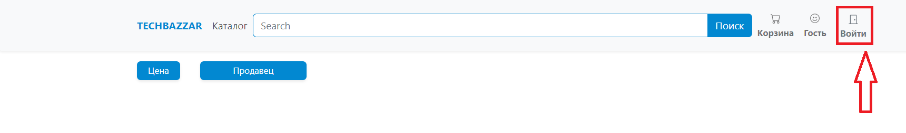
   - Вход или регистрация осуществляется через сервис Keycloak;
   - Пользоваться интернет-магазином может только зарегистрированный пользователь;
     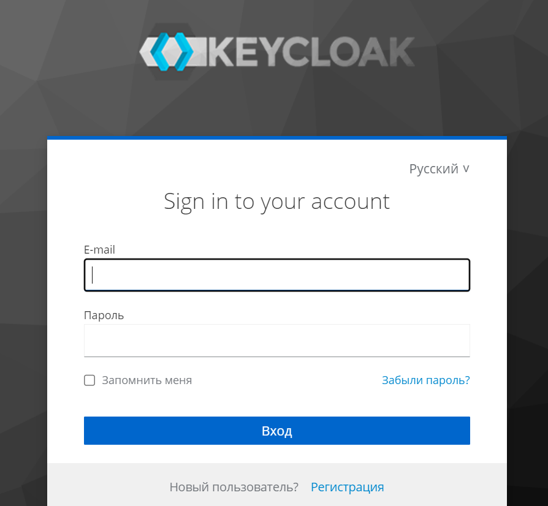
   - После входа или регистрации имя отображается в верхней части экрана;
     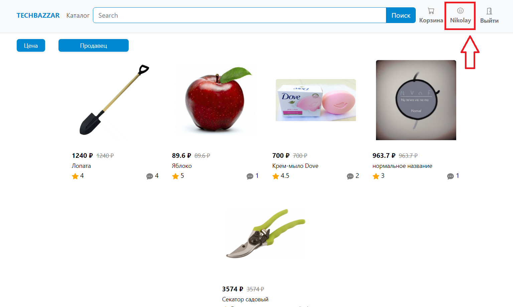
- [ ] Реализованы отзывы и оценки продукта, а так же характеристики и описание;
  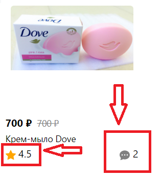
  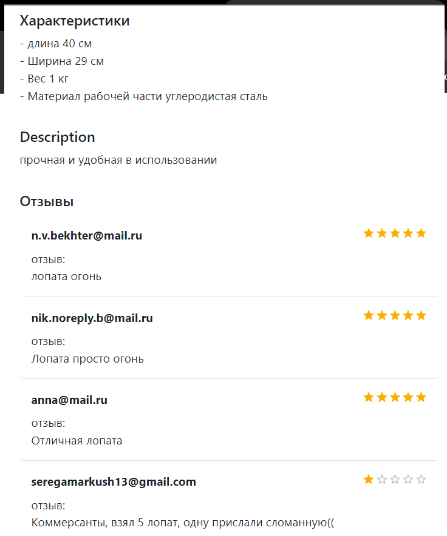
- [ ] Отзыв и оценку можно оставить только после покупки товара;
  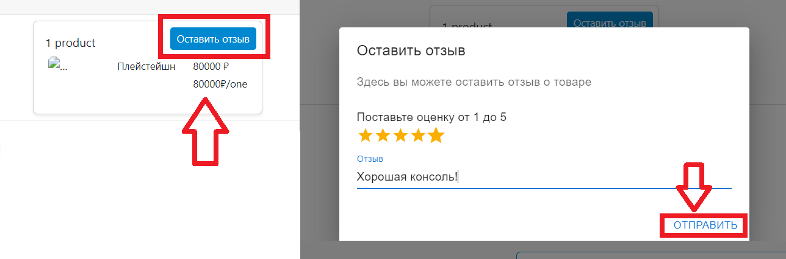

- [ ] Добавление товара в корзину:
  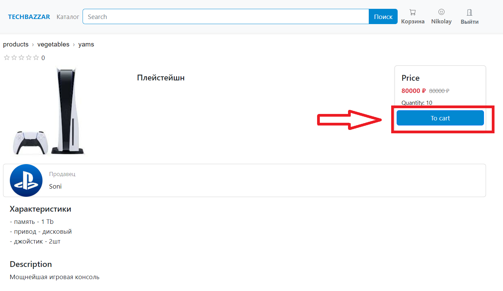
  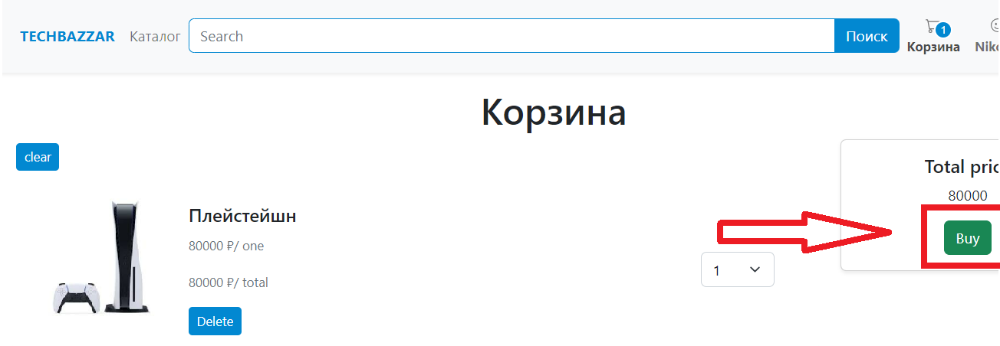

- [ ] Реализован личный кабинет.
  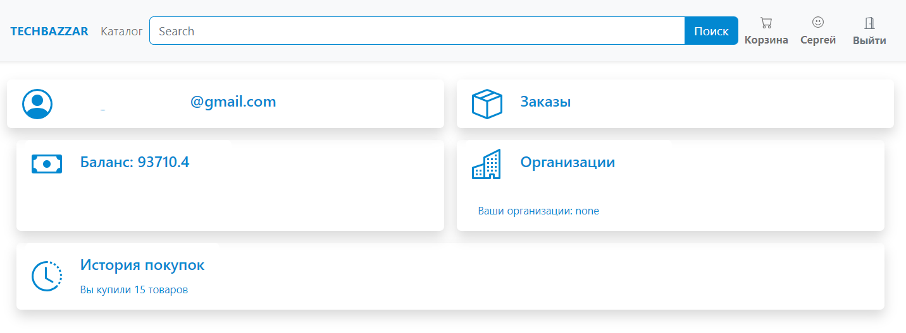
  - B личном кабинете доступно:
    - создание организации, после чего будет доступно создание товара от имени организации;
    - баланс;
    - заказы;
    - история покупок;
    
- [ ] Реализация создания организации, при нажатии кнопки "+", во вкладке "Организации";
  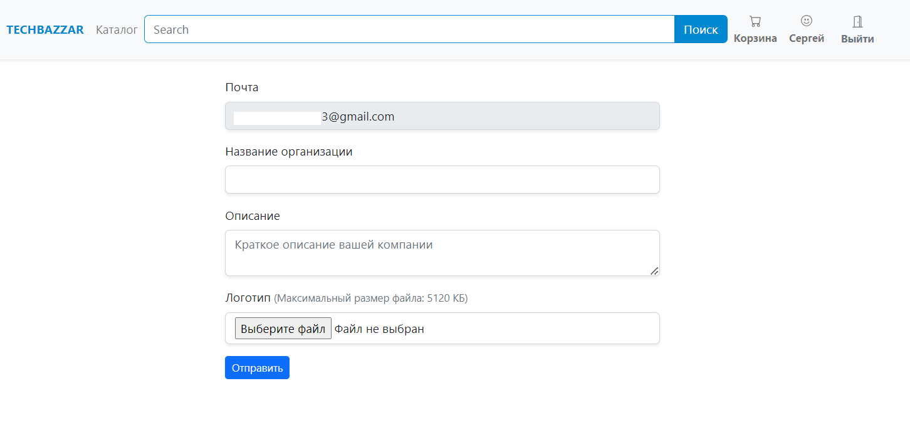
  - почта подтягивается автоматически;
  - Необходимо ввести имя организации;
  - Ввод описания организации(опционально);
  - Необходимо добавить Лого организации;
  - После создания организации модератору необходимо проверить и подтвердить создание организации,
    после чего организация будет успешно создана и можно будет добавлять товары для продажи;

- [ ] Вкладка заказы.
  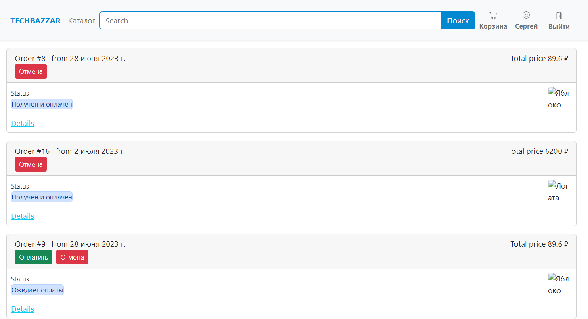
   - Показывает историю покупок, оплачен заказ или нет, возможность его оплатить или удалить,
     если заказ не оплачен или после оплаты прошло не более 24 часов, то заказ можно отменить.

- [ ] Вкладка баланс - показывает баланс.

- [ ] Если пользователь является администратором, то у него открывается вкладка администратора.
  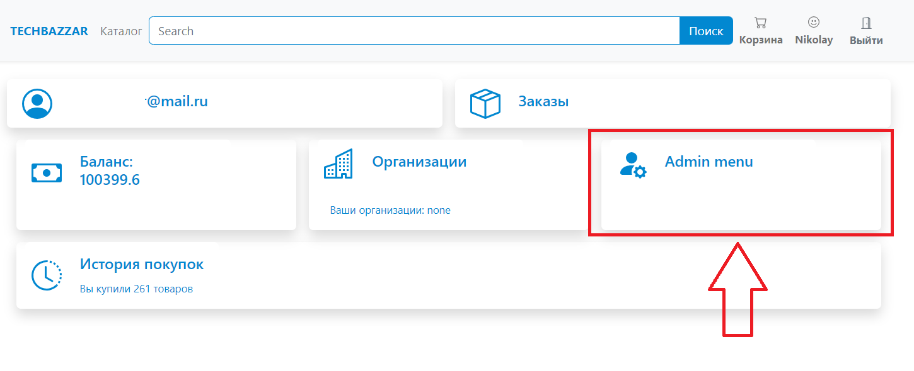
  - [ ] В которой реализовано:
    - Список всех пользователей и редактирование их баланса и возможность бана юзера.
       Забаненый пользователь не может добавлять новые организации и товары.
    - Редактор всех продуктов
      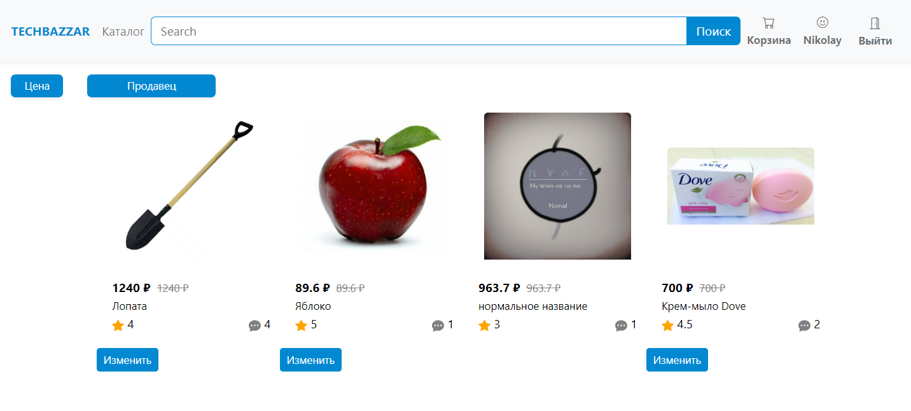
    - Модерация новых продуктов
      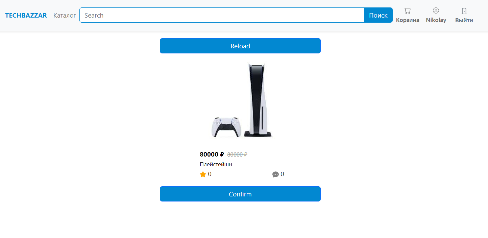
    - Модерация организаций, при этом, организацию можно забанить и все товары забаненой организации изчезают из магазина.
      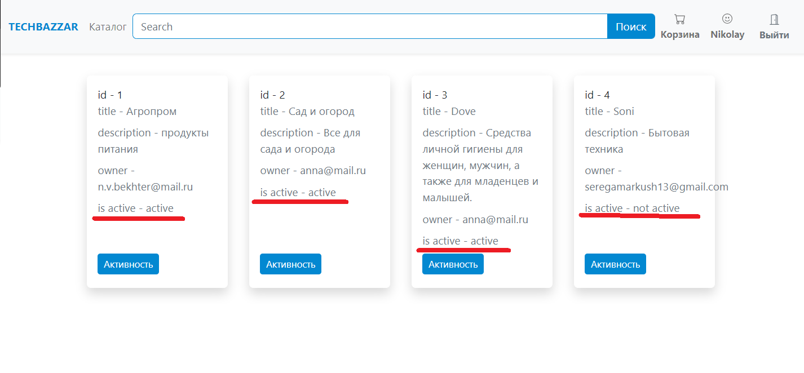
          - После одобрения товара модератором продукт попадает в каталог.
      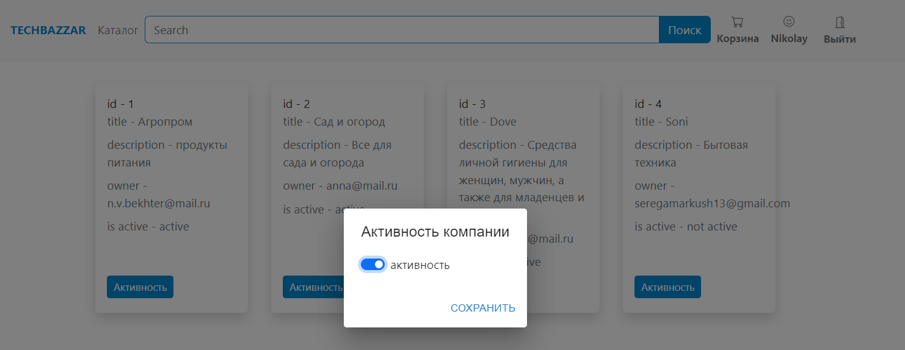
          - В истории покупок пользователя заказы от данной организации остаются.

- [ ] На главной странице реализован поиск по цене и по организациям.
  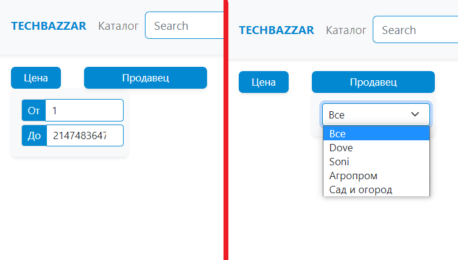
   - Так же реализован поиск товаров по названию в поле "Поиск"
     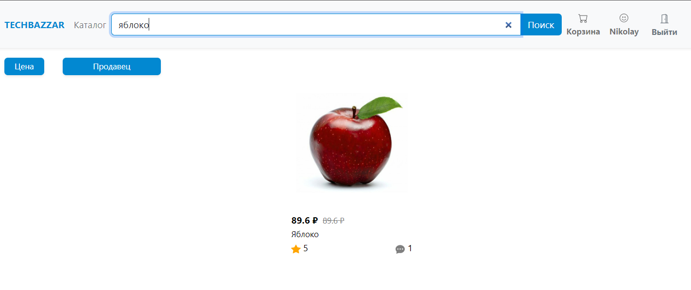

***
# Запуск проекта

***

## License

